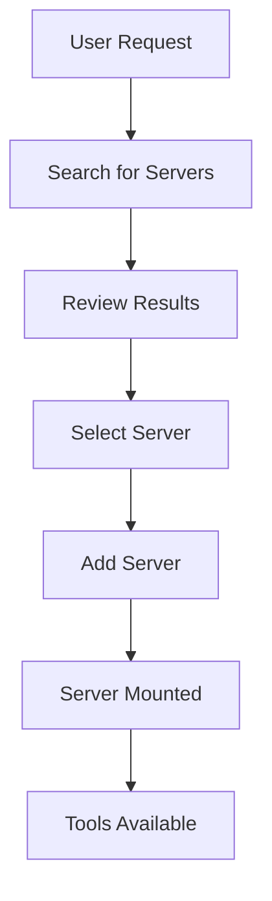
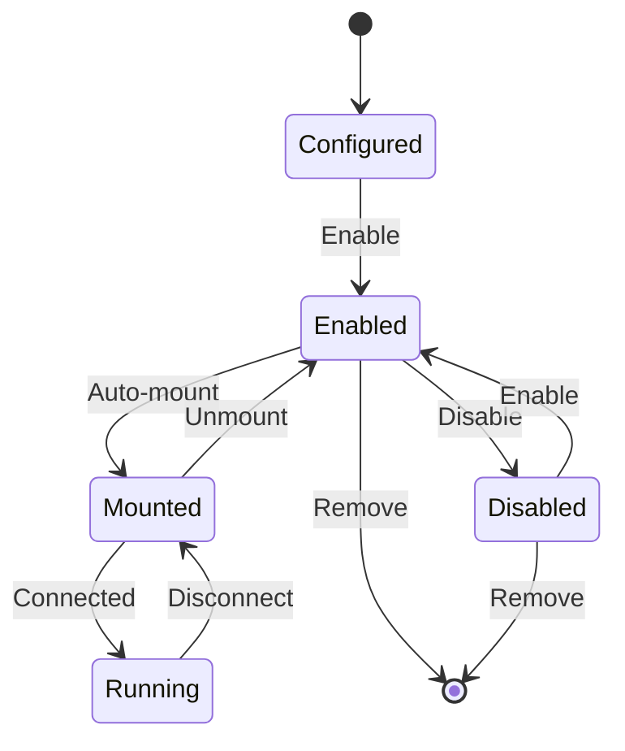
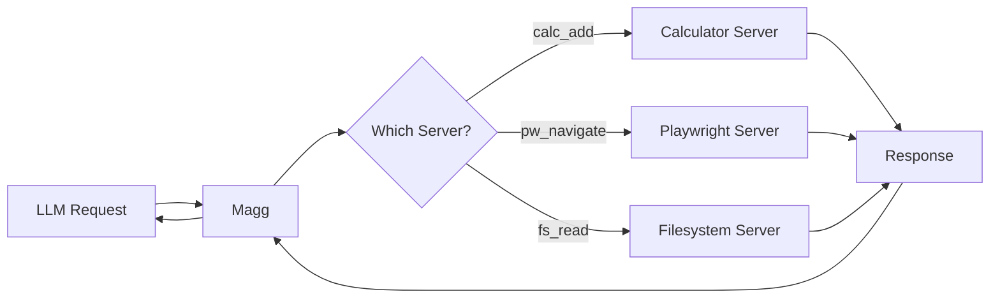

# Magg Documentation

## Table of Contents

1. [Overview](#overview)
2. [Project Components](#project-components)
3. [Getting Started](#getting-started)
4. [Usage Flows](#usage-flows)
5. [Tools Reference](#tools-reference)
6. [Resources Reference](#resources-reference)
7. [Prompts Reference](#prompts-reference)
8. [Authentication](#authentication)
9. [Proxy Documentation](#proxy-documentation)
10. [Example Sessions](#example-sessions)
11. [Advanced Configuration](#advanced-configuration)

## Overview

Magg (MCP Aggregator) is a meta-MCP server that acts as a central hub for managing multiple MCP servers. It enables LLMs to dynamically discover, add, configure, and use tools from various MCP servers through a unified interface.

### Core Concepts

- **Server**: An MCP server configuration that provides tools
- **Prefix**: A namespace prefix for tools from a specific server
- **Mounting**: The process of connecting to an MCP server and exposing its tools
- **Tool Delegation**: Proxying tool calls to the appropriate server

## Project Components

This project consists of three main components:

### 1. Magg (MCP Aggregator)
The main server-of-servers that manages multiple MCP servers, providing:
- Dynamic server discovery and configuration
- Tool namespace management with prefixes
- Unified access to tools from multiple servers
- Server lifecycle management

### 2. ProxyMCP
A powerful proxy system that enables:
- Tool-based access to all MCP capabilities (tools, resources, prompts)
- Transparent proxying of MCP operations
- Embedded resource responses for better LLM handling
- Support for both FastMCP and standard MCP implementations

### 3. MBRO (MCP Browser)
A command-line tool for browsing and interacting with MCP servers:
- Interactive command shell for exploring MCP capabilities
- Browse tools, resources, and prompts from any MCP server
- Execute operations with proper JSON argument formatting
- Connect to multiple servers and switch between them

**[MBRO Documentation](mbro.md)**: Complete guide for using the MBRO CLI tool

## Getting Started

### Installation

#### Recommended: Install with uv tool
```bash
uv tool install magg
```

#### Alternative Installation Methods

**With Poetry:**
```bash
poetry add magg
```

**With pip:**
```bash
pip install magg
```

**Direct run without installation (requires uvx):**
```bash
# From PyPI
uvx magg serve

# From git repository
uvx --from git+https://github.com/sitbon/magg.git magg serve
```

### Quick Start with Claude Desktop

Add Magg to your Claude Desktop configuration (no installation required):

```json
{
  "mcpServers": {
    "magg": {
      "command": "uvx",
      "args": ["magg", "serve"]
    }
  }
}
```

Then restart Claude Desktop and ask Claude to list available servers or search for tools.

### Quick Start with Command Line

```bash
# Run Magg server in stdio mode (after installation)
magg serve

# Or for HTTP mode
magg serve --http

# Or run directly without installation (if you have uvx)
uvx magg serve
```

## Usage Flows

### 1. Discovering and Adding Servers

The typical flow for discovering and adding new MCP servers:



**Steps:**

1. **Search for servers** using `magg_search_servers`:
   - Searches multiple sources (glama.ai, GitHub, NPM)
   - Returns servers with descriptions and URLs

2. **Review search results**:
   - Each result includes name, description, URL, and install command
   - Results are ranked by relevance and source

3. **Add selected server** using `magg_add_server`:
   - Provide name, URL, and command
   - Optional: specify prefix, working directory, notes

4. **Server is automatically mounted**:
   - Magg connects to the server
   - Tools are discovered and registered

5. **Tools become available** with configured prefix

### 2. Managing Servers

Server lifecycle management flow:



**Operations:**

- **List servers**: `magg_list_servers` shows all configured servers
- **Enable/Disable**: Control whether servers are available
- **Remove**: Completely remove server configuration
- **Check status**: See which servers are mounted and running

### 3. Using Tools from Multiple Servers

Tool aggregation and delegation flow:



## Tools Reference

### Server Management Tools

#### `magg_add_server`
Add a new MCP server to the configuration.

**Parameters:**
- `name` (str, required): Unique server name
- `source` (str, required): URL or URI of the server package/repository (can be a local path as well)
- `command` (str, optional): Full command to run (e.g., "npx @playwright/mcp@latest")
- `prefix` (str, optional): Tool prefix (defaults to server name)
- `uri` (str, optional): URI for HTTP servers
- `env_vars` (dict, optional): Environment variables
- `working_dir` (str, optional): Working directory
- `notes` (str, optional): Setup notes
- `enable` (bool, optional): Whether to enable immediately (default: true)
- `transport` (dict, optional): Transport-specific configuration

**Example:**
```json
{
    "name": "playwright",
    "source": "https://github.com/microsoft/playwright-mcp",
    "command": "npx @playwright/mcp@latest",
    "prefix": "pw",
    "notes": "Browser automation tools"
}
```

**Returns:**
```json
{
    "action": "server_added",
    "server": {
        "name": "playwright",
        "source": "https://github.com/microsoft/playwright-mcp",
        "prefix": "pw",
        "command": "npx @playwright/mcp@latest",
        "uri": null,
        "working_dir": null,
        "notes": "Browser automation tools",
        "enabled": true,
        "mounted": true
    }
}
```

#### `magg_remove_server`
Remove a server from the configuration.

**Parameters:**
- `name` (str, required): Name of server to remove

#### `magg_list_servers`
List all configured servers with their status.

**Returns:** List of server objects with their current status
```json
[{
    "name": "calculator",
    "source": "https://github.com/wrtnlabs/calculator-mcp",
    "prefix": "calc",
    "enabled": true,
    "mounted": true,
    "command": "npx -y @wrtnlabs/calculator-mcp@latest"
}]
```

#### `magg_enable_server` / `magg_disable_server`
Enable or disable a server without removing it.

**Parameters:**
- `name` (str, required): Server name to enable/disable

### Discovery Tools

#### `magg_search_servers`
Search for MCP servers across multiple sources.

**Parameters:**
- `query` (str, required): Search query
- `limit` (int, optional): Maximum results (default: 5)

**Returns:**
```json
{
    "query": "browser playwright",
    "results": [{
        "source": "github",
        "name": "Playwright MCP",
        "description": "Browser automation...",
        "url": "https://github.com/microsoft/playwright-mcp",
        "install_command": "npm install @playwright/mcp"
    }],
    "total": 1
}
```


### Configuration Tools

#### `magg_smart_configure`
Intelligently configure a server from just a URL using MCP sampling.

**Parameters:**
- `source` (str, required): URL of the server package/repository
- `server_name` (str, optional): Preferred server name (auto-generated if not provided)
- `allow_add` (bool, optional): Whether to automatically add the server after configuration (default: False)

**Note:** Requires MCP client support for sampling. If `allow_add` is True, the server will be automatically added with the generated configuration.

#### `magg_analyze_servers`
Analyze configured servers and provide insights/recommendations.

**Note:** Requires MCP client support for sampling.

### Proxy Tool

#### `proxy`
Universal proxy tool for accessing all MCP capabilities through a tool interface.

**Parameters:**
- `action` (str, required): Operation to perform - "list", "info", or "call"
- `type` (str, required): Capability type - "tool", "resource", or "prompt"
- `path` (str, optional): Name/URI of the specific capability (required for "info" and "call")
- `args` (object, optional): Arguments to pass when calling a capability

**Examples:**

List all available tools:
```json
{"action": "list", "type": "tool"}
```

Get info about a specific resource:
```json
{"action": "info", "type": "resource", "path": "file:///example.txt"}
```

Call a tool with arguments:
```json
{"action": "call", "type": "tool", "path": "calc_add", "args": {"a": 5, "b": 3}}
```

**Note:** The proxy tool enables access to resources and prompts even when the LLM client doesn't natively support them.

## Resources Reference

Magg exposes MCP resources for introspection:

### `magg://server/{name}`
Get metadata for a specific server.

**Example URI:** `magg://server/calc`

**Returns:** JSON with server configuration and status.

### `magg://servers/all`
Get metadata for all configured servers.

**Returns:** JSON with all server configurations.

## Prompts Reference

### `configure_server`
Interactive prompt for configuring a server with LLM assistance.

**Parameters:**
- `source` (str, required): URL of the server to configure
- `server_name` (str, optional): Optional server name

**Returns:** A prompt template that guides the LLM to analyze the URL and generate optimal server configuration.

**Usage:** The LLM can use this prompt to help determine optimal configuration for a server based on its URL. The prompt includes metadata collection and guides the LLM to generate a complete JSON configuration.

## Authentication

Magg supports optional bearer token authentication using RSA keypairs and JWT tokens. When enabled, all clients must provide a valid JWT token to access the server.

For a complete guide, see **[Authentication Guide](authentication.md)**.

### Setting Up Authentication

1. **Initialize authentication** (one-time setup):
   ```bash
   magg auth init
   ```
   This generates an RSA keypair in `~/.ssh/magg/` (or custom location via `--key-path`).

2. **Check authentication status**:
   ```bash
   magg auth status
   ```

3. **Generate JWT tokens** for clients:
   ```bash
   # Display token on screen
   magg auth token
   
   # Export to environment variable
   export MAGG_JWT=$(magg auth token -q)
   
   # Generate with custom parameters
   magg auth token --subject "my-app" --hours 72 --scopes "read" "write"
   ```

### Client Connection

#### Using MaggClient (Recommended)
```python
from magg.client import MaggClient

# Automatically uses MAGG_JWT environment variable
async with MaggClient("http://localhost:8000/mcp") as client:
    tools = await client.list_tools()
```

#### Using FastMCP Client
```python
from fastmcp import Client
from fastmcp.client import BearerAuth

# With explicit token
jwt_token = "your-jwt-token"
auth = BearerAuth(jwt_token)
async with Client("http://localhost:8000/mcp", auth=auth) as client:
    tools = await client.list_tools()
```

### Key Management

- **Default key location**: `~/.ssh/magg/{audience}.key` and `{audience}.key.pub`
- **Environment variable**: Set `MAGG_PRIVATE_KEY` to use key from environment
- **Custom location**: Configure in `.magg/auth.json`

### Disabling Authentication

To disable authentication:
1. Remove the key files, or
2. Set a non-existent `key_path` in `.magg/auth.json`:
   ```json
   {
     "bearer": {
       "key_path": "/path/that/does/not/exist"
     }
   }
   ```

### Authentication Commands Reference

- `magg auth init [--audience NAME] [--issuer URL] [--key-path PATH]` - Initialize authentication
- `magg auth status` - Display current auth configuration
- `magg auth token [--quiet] [--export] [--subject USER] [--hours N] [--scopes ...]` - Generate JWT
- `magg auth public-key` - Display public key in PEM format
- `magg auth private-key [--export] [--oneline]` - Display private key

### Security Notes

- Private keys are saved with permissions 0600 (owner read/write only)
- Never commit private keys to version control
- Use environment variables for production deployments
- Tokens include standard JWT claims: iss, aud, sub, iat, exp
- Optional scopes can be included but are not enforced by Magg

## Proxy Documentation

Magg includes a powerful tool called `proxy` that provides tool-based access to all MCP capabilities. The proxy enables LLMs to interact with resources and prompts through a tool interface, making all MCP operations accessible even when the client doesn't support direct resource or prompt access.

### Key Features
- **Unified Interface**: Access tools, resources, and prompts through a single `proxy` tool
- **Transparent Proxying**: Maintains full compatibility with the MCP protocol
- **Embedded Resources**: Returns resources as embedded content for better LLM handling
- **Type Safety**: Includes metadata annotations for operation tracking

### Documentation
- **[Proxy User Guide](proxy.md)**: Comprehensive guide for using the proxy tool
- **[Proxy Specification](proxy-spec.md)**: Technical specification and implementation details

### Using the Proxy Tool

The `proxy` tool accepts a JSON object as its arguments. Here are some examples:

**List all tools from mounted servers:**
```json
{
  "action": "list",
  "type": "tool"
}
```

**Call a specific tool through the proxy:**
```json
{
  "action": "call",
  "type": "tool",
  "path": "calc_add",
  "args": {"a": 5, "b": 3}
}
```

**Read a resource:**
```json
{
  "action": "call",
  "type": "resource",
  "path": "file:///example.txt"
}
```

When using Magg through an LLM interface (like Claude), you would call it like:
- Tool name: `proxy`
- Arguments: One of the JSON objects shown above

## Example Sessions

See [examples.md](examples.md) for detailed example sessions demonstrating Magg's capabilities.

## Advanced Configuration

### Server Configuration File

Servers are stored in the current directory under `.magg/config.json`:

```json
{
  "servers": {
    "calc": {
      "name": "calc",
      "source": "https://github.com/wrtnlabs/calculator-mcp",
      "prefix": "calc",
      "notes": null,
      "command": "npx",
      "args": [
        "-y",
        "@wrtnlabs/calculator-mcp@latest"
      ],
      "uri": null,
      "env": null,
      "working_dir": null,
      "transport": null,
      "enabled": true
    }
  }
}
```

### Custom Server Setup

For servers requiring special setup:

**With virtual environment:**
   ```json
   {
     "name": "custom-server",
     "source": "file:///path/to/server", 
     "prefix": "custom",
     "command": "uv run python server.py",
     "working_dir": "/path/to/server"
   }
   ```

**With Docker:**
   ```json
   {
     "name": "docker-server",
     "source": "docker://myimage:tag", 
     "prefix": "myimage",
     "command": "docker run -i myimage:tag",
     "env": {
       "DOCKER_HOST": "unix:///var/run/docker.sock"
     }
   }
   ```

### Debugging

Enable debug logging to troubleshoot issues:

```bash
MAGG_LOG_LEVEL=DEBUG magg serve --http
```

Check logs for:
- Server mounting failures
- Tool delegation errors
- Configuration problems

### Performance Optimization

1. **Disable unused servers** to reduce memory usage
2. **Use specific prefixes** to avoid tool name conflicts
3. **Monitor server processes** for resource usage

### Security Considerations

1. **Authentication**: Enable bearer token auth for production deployments
2. **API Keys**: Store in environment variables, never in configuration
3. **File Access**: Be cautious with filesystem servers
4. **Network Access**: Review server permissions for network operations
5. **Process Isolation**: Consider running servers in containers for isolation
6. **Token Security**: Never expose JWT tokens in logs or error messages
