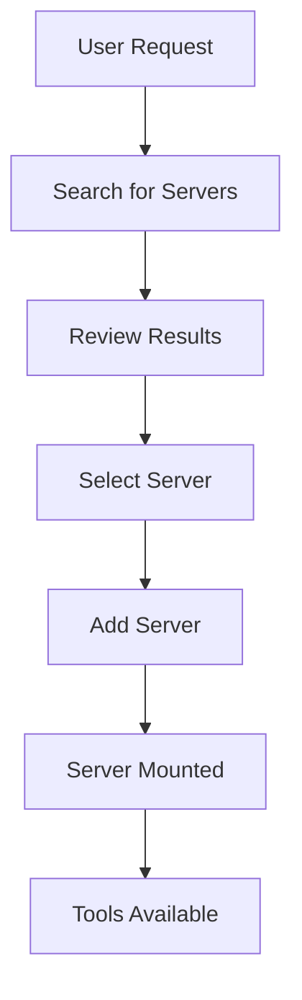
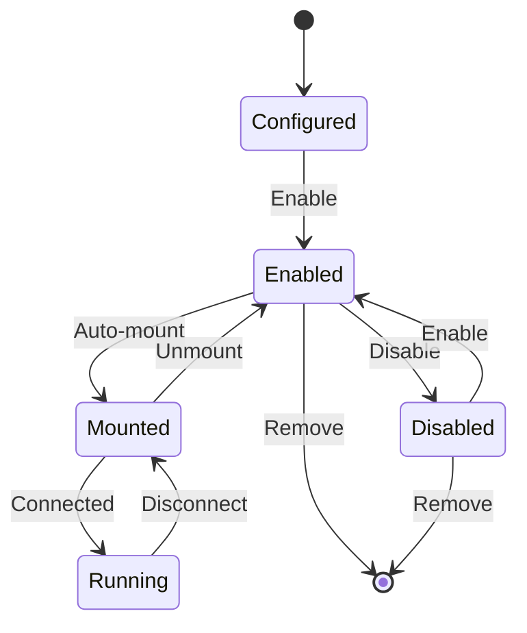
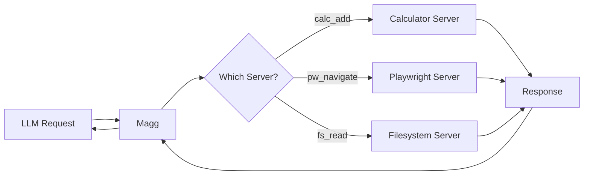

# Magg Documentation

## Table of Contents

1. [Overview](#overview)
2. [Project Components](#project-components)
3. [Getting Started](#getting-started)
4. [Usage Flows](#usage-flows)
5. [Tools Reference](#tools-reference)
6. [Resources Reference](#resources-reference)
7. [Prompts Reference](#prompts-reference)
8. [Kit Management](#kit-management)
9. [Authentication](#authentication)
10. [Configuration Reload](#configuration-reload)
11. [Messaging and Notifications](#messaging-and-notifications)
12. [Proxy Documentation](#proxy-documentation)
13. [Example Sessions](#example-sessions)
14. [Advanced Configuration](#advanced-configuration)

## Overview

Magg (MCP Aggregator) is a meta-MCP server that acts as a central hub for managing multiple MCP servers. It enables LLMs to dynamically discover, add, configure, and use tools from various MCP servers through a unified interface.

### Core Concepts

- **Server**: An MCP server configuration that provides tools
- **Prefix**: A namespace prefix for tools from a specific server
- **Mounting**: The process of connecting to an MCP server and exposing its tools
- **Tool Delegation**: Proxying tool calls to the appropriate server
- **Kit**: A bundle of related MCP servers that can be loaded/unloaded as a group

## Project Components

This project consists of three main components:

### 1. Magg (MCP Aggregator)
The main server-of-servers that manages multiple MCP servers, providing:
- Dynamic server discovery and configuration
- Tool namespace management with prefixes
- Unified access to tools from multiple servers
- Server lifecycle management

### 2. ProxyMCP
A powerful proxy system that enables:
- Tool-based access to all MCP capabilities (tools, resources, prompts)
- Transparent proxying of MCP operations
- Embedded resource responses for better LLM handling
- Support for both FastMCP and standard MCP implementations

### 3. MBRO (MCP Browser)
A command-line tool for browsing and interacting with MCP servers:
- Interactive command shell for exploring MCP capabilities
- Browse tools, resources, and prompts from any MCP server
- Execute operations with proper JSON argument formatting
- Connect to multiple servers and switch between them

**[MBRO Documentation](mbro.md)**: Complete guide for using the MBRO CLI tool

## Getting Started

### Installation

#### Recommended: Install with uv tool
```bash
uv tool install magg
```

#### Alternative Installation Methods

**With Poetry:**
```bash
poetry add magg
```

**With pip:**
```bash
pip install magg
```

**Direct run without installation (requires uvx):**
```bash
# From PyPI
uvx magg serve

# From git repository
uvx --from git+https://github.com/sitbon/magg.git magg serve
```

### Quick Start with Claude Desktop

Add Magg to your Claude Desktop configuration (no installation required):

```json
{
  "mcpServers": {
    "magg": {
      "command": "uvx",
      "args": ["magg", "serve"]
    }
  }
}
```

Then restart Claude Desktop and ask Claude to list available servers or search for tools.

### Quick Start with Command Line

```bash
# Run Magg server in stdio mode (after installation)
magg serve

# Or for HTTP mode
magg serve --http

# Or for hybrid mode (both stdio and HTTP simultaneously)
magg serve --hybrid
magg serve --hybrid --port 8080  # Custom port

# Or run directly without installation (if you have uvx)
uvx magg serve
```

#### Hybrid Mode

Magg supports running in hybrid mode where it accepts connections via both stdio and HTTP simultaneously. This is particularly useful when you want to:

- Use Magg through an MCP client (stdio) while also accessing it via HTTP API
- Have mbro host the server while connecting to it via stdio
- Test both interfaces without running multiple instances

**Example with mbro:**
```bash
# mbro can host Magg in hybrid mode and connect to it via stdio
mbro connect magg "magg serve --hybrid --port 8080"

# Now Magg is:
# - Connected to mbro via stdio
# - Also accessible via HTTP at http://localhost:8080

# Other mbro instances can now connect via HTTP
mbro connect magg-remote http://localhost:8080
```

This allows you to use mbro's interactive features while other clients (including other mbro instances) can connect via HTTP.

## Usage Flows

### 1. Discovering and Adding Servers

The typical flow for discovering and adding new MCP servers:



**Steps:**

1. **Search for servers** using `magg_search_servers`:
   - Searches multiple sources (glama.ai, GitHub, NPM)
   - Returns servers with descriptions and URLs

2. **Review search results**:
   - Each result includes name, description, URL, and install command
   - Results are ranked by relevance and source

3. **Add selected server** using `magg_add_server`:
   - Provide name, URL, and command
   - Optional: specify prefix, working directory, notes

4. **Server is automatically mounted**:
   - Magg connects to the server
   - Tools are discovered and registered

5. **Tools become available** with configured prefix

### 2. Managing Servers

Server lifecycle management flow:



**Operations:**

- **List servers**: `magg_list_servers` shows all configured servers
- **Enable/Disable**: Control whether servers are available
- **Remove**: Completely remove server configuration
- **Check status**: See which servers are mounted and running

### 3. Using Tools from Multiple Servers

Tool aggregation and delegation flow:



## Tools Reference

### Server Management Tools

#### `magg_add_server`
Add a new MCP server to the configuration.

**Parameters:**
- `name` (str, required): Unique server name
- `source` (str, required): URL or URI of the server package/repository (can be a local path as well)
- `command` (str, optional): Full command to run (e.g., "npx @playwright/mcp@latest")
- `prefix` (str, optional): Tool prefix (defaults to server name)
- `uri` (str, optional): URI for HTTP servers
- `env` (dict|str, optional): Environment variables (can be a dict or JSON string)
- `cwd` (str, optional): Working directory
- `notes` (str, optional): Setup notes
- `enable` (bool, optional): Whether to enable immediately (default: true)
- `transport` (dict|str, optional): Transport-specific configuration (can be a dict or JSON string)

**Example:**
```json
{
    "name": "playwright",
    "source": "https://github.com/microsoft/playwright-mcp",
    "command": "npx @playwright/mcp@latest",
    "prefix": "pw",
    "notes": "Browser automation tools"
}
```

**Returns:**
```json
{
    "action": "server_added",
    "server": {
        "name": "playwright",
        "source": "https://github.com/microsoft/playwright-mcp",
        "prefix": "pw",
        "command": "npx @playwright/mcp@latest",
        "uri": null,
        "cwd": null,
        "notes": "Browser automation tools",
        "enabled": true,
        "mounted": true
    }
}
```

#### `magg_remove_server`
Remove a server from the configuration.

**Parameters:**
- `name` (str, required): Name of server to remove

#### `magg_list_servers`
List all configured servers with their status.

**Returns:** List of server objects with their current status
```json
[{
    "name": "calculator",
    "source": "https://github.com/wrtnlabs/calculator-mcp",
    "prefix": "calc",
    "enabled": true,
    "mounted": true,
    "command": "npx -y @wrtnlabs/calculator-mcp@latest"
}]
```

#### `magg_enable_server` / `magg_disable_server`
Enable or disable a server without removing it.

**Parameters:**
- `name` (str, required): Server name to enable/disable

#### `magg_reload_config`
Reload configuration from disk and apply changes dynamically.

**Note:** This operation may briefly interrupt service for affected servers. Config reload can also be triggered via SIGHUP signal on Unix systems or happens automatically when the config file is modified (if auto-reload is enabled).

**Returns:**
```json
{
    "message": "Configuration reloaded successfully",
    "config_path": "/path/to/.magg/config.json",
    "read_only": false
}
```

#### `magg_status`
Get server and tool statistics for monitoring and debugging.

**Returns:**
```json
{
    "servers": {
        "total": 5,
        "enabled": 4,
        "mounted": 3,
        "disabled": 1
    },
    "tools": {
        "total": 47
    },
    "prefixes": {
        "calculator": "calc",
        "playwright": "pw",
        "filesystem": "fs"
    }
}
```

#### `magg_check`
Perform health checks on configured servers with optional remediation actions.

**Parameters:**
- `action` (str, optional): Action to perform - "report" (default), "remount", "unmount", or "disable"
- `timeout` (float, optional): Health check timeout in seconds (default: 0.5)

**Actions:**
- `report`: Check server health and return status report
- `remount`: Attempt to remount failed servers
- `unmount`: Unmount failed servers
- `disable`: Disable failed servers in configuration

**Returns:**
```json
{
    "action": "report",
    "servers": {
        "calculator": {
            "name": "calculator",
            "enabled": true,
            "mounted": true,
            "healthy": true,
            "prefix": "calc"
        },
        "broken-server": {
            "name": "broken-server", 
            "enabled": true,
            "mounted": false,
            "healthy": false,
            "prefix": "broken",
            "error": "Connection timeout"
        }
    },
    "summary": {
        "total": 2,
        "healthy": 1,
        "unhealthy": 1,
        "actions_taken": 0
    }
}
```

### Discovery Tools

#### `magg_search_servers`
Search for MCP servers across multiple sources.

**Parameters:**
- `query` (str, required): Search query
- `limit` (int, optional): Maximum results (default: 5)

**Returns:**
```json
{
    "query": "browser playwright",
    "results": [{
        "source": "github",
        "name": "Playwright MCP",
        "description": "Browser automation...",
        "url": "https://github.com/microsoft/playwright-mcp",
        "install_command": "npm install @playwright/mcp"
    }],
    "total": 1
}
```


### Configuration Tools

#### `magg_smart_configure`
Intelligently configure a server from just a URL using MCP sampling.

**Parameters:**
- `source` (str, required): URL of the server package/repository
- `server_name` (str, optional): Preferred server name (auto-generated if not provided)
- `allow_add` (bool, optional): Whether to automatically add the server after configuration (default: False)

**Note:** Requires MCP client support for sampling. If `allow_add` is True, the server will be automatically added with the generated configuration.

#### `magg_analyze_servers`
Analyze configured servers and provide insights/recommendations.

**Note:** Requires MCP client support for sampling.

### Kit Management Tools

#### `magg_load_kit`
Load a kit and all its servers into the configuration.

**Parameters:**
- `name` (str, required): Kit name to load (filename without .json)

**Returns:**
```json
{
    "action": "kit_loaded",
    "kit": "web-tools",
    "message": "Kit 'web-tools' loaded successfully. Added servers: browser, scraper"
}
```

#### `magg_unload_kit`
Unload a kit and optionally remove its servers.

**Parameters:**
- `name` (str, required): Kit name to unload

**Returns:**
```json
{
    "action": "kit_unloaded",
    "kit": "web-tools",
    "message": "Kit 'web-tools' unloaded successfully. Removed servers: browser"
}
```

#### `magg_list_kits`
List all available kits with their status.

**Returns:**
```json
{
    "kits": {
        "web-tools": {
            "loaded": true,
            "description": "Web automation and scraping tools",
            "author": "Magg Team",
            "servers": ["browser", "scraper"]
        },
        "dev-tools": {
            "loaded": false,
            "description": "Development tools",
            "servers": ["git", "github"]
        }
    },
    "summary": {
        "total": 2,
        "loaded": 1,
        "available": 1
    }
}
```

#### `magg_kit_info`
Get detailed information about a specific kit.

**Parameters:**
- `name` (str, required): Kit name to get information about

**Returns:** Detailed kit metadata including all servers and their configurations.

### Proxy Tool

#### `proxy`
Universal proxy tool for accessing all MCP capabilities through a tool interface.

**Parameters:**
- `action` (str, required): Operation to perform - "list", "info", or "call"
- `type` (str, required): Capability type - "tool", "resource", or "prompt"
- `path` (str, optional): Name/URI of the specific capability (required for "info" and "call")
- `args` (object, optional): Arguments to pass when calling a capability

**Examples:**

List all available tools:
```json
{"action": "list", "type": "tool"}
```

Get info about a specific resource:
```json
{"action": "info", "type": "resource", "path": "file:///example.txt"}
```

Call a tool with arguments:
```json
{"action": "call", "type": "tool", "path": "calc_add", "args": {"a": 5, "b": 3}}
```

**Note:** The proxy tool enables access to resources and prompts even when the LLM client doesn't natively support them.

## Resources Reference

Magg exposes MCP resources for introspection:

### `magg://server/{name}`
Get metadata for a specific server.

**Example URI:** `magg://server/calc`

**Returns:** JSON with server configuration and status.

### `magg://servers/all`
Get metadata for all configured servers.

**Returns:** JSON with all server configurations.

## Prompts Reference

### `configure_server`
Interactive prompt for configuring a server with LLM assistance.

**Parameters:**
- `source` (str, required): URL of the server to configure
- `server_name` (str, optional): Optional server name

**Returns:** A prompt template that guides the LLM to analyze the URL and generate optimal server configuration.

**Usage:** The LLM can use this prompt to help determine optimal configuration for a server based on its URL. The prompt includes metadata collection and guides the LLM to generate a complete JSON configuration.

## Kit Management

Kits are a way to bundle related MCP servers together for easy installation and management. Think of them as "packages" or "toolkits" that group servers with similar functionality.

### What are Kits?

- JSON files stored in `~/.magg/kit.d/` or `.magg/kit.d/`
- Bundle related servers with metadata (description, author, version, etc.)
- Can be loaded/unloaded as a group
- Servers track which kits they came from
- Servers shared by multiple kits are only removed when their last kit is unloaded

### Kit Discovery

Magg looks for kits in these locations:
1. `$MAGG_KITD_PATH` (defaults to `~/.magg/kit.d`)
2. `.magg/kit.d` in the same directory as your `config.json`

### Creating Kits

Example kit file (`~/.magg/kit.d/web-tools.json`):
```json
{
  "name": "web-tools",
  "description": "Web automation and scraping tools",
  "author": "Your Name",
  "version": "1.0.0",
  "keywords": ["web", "browser", "scraping"],
  "links": {
    "homepage": "https://github.com/example/web-tools-kit"
  },
  "servers": {
    "playwright": {
      "source": "https://github.com/microsoft/playwright-mcp",
      "command": "npx",
      "args": ["@playwright/mcp@latest"],
      "enabled": true
    },
    "scraper": {
      "source": "https://github.com/example/scraper-mcp",
      "uri": "http://localhost:8080/mcp"
    }
  }
}
```

### Using Kits

```bash
# List all available kits
mbro:magg> call magg_list_kits

# Load a kit (adds all its servers)
mbro:magg> call magg_load_kit name="web-tools"

# Get detailed info about a kit
mbro:magg> call magg_kit_info name="web-tools"

# Unload a kit
mbro:magg> call magg_unload_kit name="web-tools"
```

For complete documentation, see **[Kit Management Guide](kits.md)**.

## Authentication

Magg supports optional bearer token authentication using RSA keypairs and JWT tokens. When enabled, all clients must provide a valid JWT token to access the server.

For a complete guide, see **[Authentication Guide](authentication.md)**.

### Setting Up Authentication

1. **Initialize authentication** (one-time setup):
   ```bash
   magg auth init
   ```
   This generates an RSA keypair in `~/.ssh/magg/` (or custom location via `--key-path`).

2. **Check authentication status**:
   ```bash
   magg auth status
   ```

3. **Generate JWT tokens** for clients:
   ```bash
   # Display token on screen
   magg auth token
   
   # Export to environment variable
   export MAGG_JWT=$(magg auth token -q)
   
   # Generate with custom parameters
   magg auth token --subject "my-app" --hours 72 --scopes "read" "write"
   ```

### Client Connection

#### Using MaggClient (Recommended)
```python
from magg.client import MaggClient

# Automatically uses MAGG_JWT environment variable
async with MaggClient("http://localhost:8000/mcp") as client:
    tools = await client.list_tools()
```

#### Using FastMCP Client
```python
from fastmcp import Client
from fastmcp.client import BearerAuth

# With explicit token
jwt_token = "your-jwt-token"
auth = BearerAuth(jwt_token)
async with Client("http://localhost:8000/mcp", auth=auth) as client:
    tools = await client.list_tools()
```

### Key Management

- **Default key location**: `~/.ssh/magg/{audience}.key` and `{audience}.key.pub`
- **Environment variable**: Set `MAGG_PRIVATE_KEY` to use key from environment
- **Custom location**: Configure in `.magg/auth.json`

### Disabling Authentication

To disable authentication:
1. Remove the key files, or
2. Set a non-existent `key_path` in `.magg/auth.json`:
   ```json
   {
     "bearer": {
       "key_path": "/path/that/does/not/exist"
     }
   }
   ```

### Authentication Commands Reference

- `magg auth init [--audience NAME] [--issuer URL] [--key-path PATH]` - Initialize authentication
- `magg auth status` - Display current auth configuration
- `magg auth token [--quiet] [--export] [--subject USER] [--hours N] [--scopes ...]` - Generate JWT
- `magg auth public-key` - Display public key in PEM format
- `magg auth private-key [--export] [--oneline]` - Display private key

### Security Notes

- Private keys are saved with permissions 0600 (owner read/write only)
- Never commit private keys to version control
- Use environment variables for production deployments
- Tokens include standard JWT claims: iss, aud, sub, iat, exp
- Optional scopes can be included but are not enforced by Magg

## Configuration Reload

Magg supports dynamic configuration reloading without requiring a restart. This allows you to update server configurations while Magg is running, with minimal disruption to active services.

### Features

- **Automatic File Watching**: Detects changes to `config.json` and reloads automatically
- **Signal Support**: Send SIGHUP to trigger immediate reload (Unix-like systems)
- **MCP Tool**: Use `magg_reload_config` tool from any MCP client
- **Smart Transitions**: Only affected servers are restarted during reload
- **Graceful Handling**: Invalid configurations are rejected without affecting running servers

### How It Works

When configuration changes are detected, Magg:
1. Loads and validates the new configuration
2. Compares it with the current configuration
3. Identifies changes (added, removed, modified, enabled/disabled servers)
4. Applies changes in order: remove → disable → update → enable → add
5. Only restarts servers that actually changed

### Configuration Options

- `MAGG_AUTO_RELOAD` (default: `true`) - Enable/disable automatic configuration reloading
- `MAGG_RELOAD_POLL_INTERVAL` (default: `1.0`) - Polling interval in seconds when watchdog unavailable
- `MAGG_RELOAD_USE_WATCHDOG` (default: auto-detect) - Force watchdog on/off or let it auto-detect
- `MAGG_STDERR_SHOW` (default: `false`) - Show stderr output from subprocess MCP servers
- `MAGG_PREFIX_SEP` (default: `_`) - Separator between prefix and tool name
- `MAGG_SELF_PREFIX` (default: `magg`) - Prefix for Magg's own tools

### Environment Variable Inheritance

By default, stdio-based MCP servers run with isolated environments. While the recommended approach is to configure environment variables in the server configuration (see Advanced Configuration), you can also pass environment variables at runtime to all stdio subprocesses:

**Pass current environment to servers:**
```bash
magg serve --env-pass
```

**Set specific environment variables:**
```bash
magg serve --env-set API_KEY mykey --env-set LANG en_US.UTF-8
```

**Combined usage:**
```bash
# Pass current env and add specific variables
magg serve --env-pass --env-set DEBUG true
```

This is useful for:
- Passing API keys and authentication tokens to servers
- Sharing PATH and system configuration
- Development environments where servers need local tools
- CI/CD pipelines with environment-based configuration

**Note:** 
- Environment inheritance only affects stdio-based servers. HTTP/URI servers do not receive inherited environment variables.
- The preferred method is to set environment variables in the server configuration's `env` field for better reproducibility.
- The `mbro` CLI tool also supports these same `--env-pass` and `--env-set` flags when connecting to servers.

### Usage Examples

**Automatic reload (default):**
```bash
# Start Magg with auto-reload enabled
magg serve --http

# Edit config in another terminal
vim .magg/config.json
# Changes are applied automatically!
```

**Manual reload via signal:**
```bash
# Find Magg process
ps aux | grep magg

# Send SIGHUP to reload
kill -HUP <pid>
```

**Manual reload via tool:**
```python
# From an MCP client
result = await client.call_tool("magg_reload_config")
```

### What Can Be Reloaded

✅ **Supported changes:**
- Adding/removing servers
- Enabling/disabling servers
- Modifying server configurations (command, args, environment, etc.)
- Changing server prefixes (requires remove + add)

❌ **Requires restart:**
- Magg's own settings (log level, port, authentication)
- Changes to auto_reload settings themselves

For complete documentation, see **[Configuration Reload Guide](config-reload.md)**.

## Messaging and Notifications

Magg provides comprehensive support for MCP messaging and notifications, enabling real-time communication between clients and backend servers. This feature leverages FastMCP's messaging capabilities to provide transparent message forwarding across multiple backend servers.

### Key Features
- **Transparent Message Forwarding**: All notifications from backend servers are automatically forwarded to clients
- **Message Aggregation**: Coordinates notifications from multiple backend servers  
- **Real-time Updates**: Receive immediate notifications for tool/resource/prompt list changes
- **Progress Tracking**: Monitor long-running operations across all servers
- **Custom Handlers**: Implement custom logic for different notification types

### Supported Notifications
- **Tool List Changes**: When backend servers add/remove/modify tools
- **Resource List Changes**: When available resources change
- **Prompt List Changes**: When available prompts change  
- **Progress Updates**: For long-running operations
- **Log Messages**: Server logs forwarded to clients
- **Resource Updates**: When individual resources are modified

### Basic Usage

```python
from magg import MaggClient, MaggMessageHandler

# Create message handler with callbacks
handler = MaggMessageHandler(
    on_tool_list_changed=lambda notif: print("Tools changed!"),
    on_progress=lambda notif: print(f"Progress: {notif.progress}")
)

# Create client with message handling
client = MaggClient("http://localhost:8000", message_handler=handler)

async with client:
    # All notifications from backend servers automatically forwarded
    tools = await client.list_tools()
```

### Advanced Features
- **Server-specific handlers** for targeted message routing
- **Message coordination** with deduplication and aggregation
- **Custom handler classes** for complex notification logic
- **Debug capabilities** for monitoring message flow

For complete documentation, see **[Messaging Guide](messaging.md)**.

## Proxy Documentation

Magg includes a powerful tool called `proxy` that provides tool-based access to all MCP capabilities. The proxy enables LLMs to interact with resources and prompts through a tool interface, making all MCP operations accessible even when the client doesn't support direct resource or prompt access.

### Key Features
- **Unified Interface**: Access tools, resources, and prompts through a single `proxy` tool
- **Transparent Proxying**: Maintains full compatibility with the MCP protocol
- **Embedded Resources**: Returns resources as embedded content for better LLM handling
- **Type Safety**: Includes metadata annotations for operation tracking

### Documentation
- **[Proxy User Guide](proxy.md)**: Comprehensive guide for using the proxy tool
- **[Proxy Specification](proxy-spec.md)**: Technical specification and implementation details

### Using the Proxy Tool

The `proxy` tool accepts a JSON object as its arguments. Here are some examples:

**List all tools from mounted servers:**
```json
{
  "action": "list",
  "type": "tool"
}
```

**Call a specific tool through the proxy:**
```json
{
  "action": "call",
  "type": "tool",
  "path": "calc_add",
  "args": {"a": 5, "b": 3}
}
```

**Read a resource:**
```json
{
  "action": "call",
  "type": "resource",
  "path": "file:///example.txt"
}
```

When using Magg through an LLM interface (like Claude), you would call it like:
- Tool name: `proxy`
- Arguments: One of the JSON objects shown above

## Example Sessions

See [examples.md](examples.md) for detailed example sessions demonstrating Magg's capabilities.

## Advanced Configuration

### Server Configuration File

Servers are stored in the current directory under `.magg/config.json`:

```json
{
  "servers": {
    "calc": {
      "name": "calc",
      "source": "https://github.com/wrtnlabs/calculator-mcp",
      "prefix": "calc",
      "notes": null,
      "command": "npx",
      "args": [
        "-y",
        "@wrtnlabs/calculator-mcp@latest"
      ],
      "uri": null,
      "env": null,
      "cwd": null,
      "transport": null,
      "enabled": true
    }
  }
}
```

### Custom Server Setup

For servers requiring special setup:

**With virtual environment:**
   ```json
   {
     "name": "custom-server",
     "source": "file:///path/to/server", 
     "prefix": "custom",
     "command": "uv run python server.py",
     "cwd": "/path/to/server"
   }
   ```

**With Docker:**
   ```json
   {
     "name": "docker-server",
     "source": "docker://myimage:tag", 
     "prefix": "myimage",
     "command": "docker run -i myimage:tag",
     "env": {
       "DOCKER_HOST": "unix:///var/run/docker.sock"
     }
   }
   ```

### Debugging

Enable debug logging to troubleshoot issues:

```bash
MAGG_LOG_LEVEL=DEBUG magg serve --http
```

Check logs for:
- Server mounting failures
- Tool delegation errors
- Configuration problems

### Tool Naming and Prefix System

#### Understanding Tool Names

Magg organizes tools from multiple servers using a prefix system. Every tool name follows this pattern:

```
{prefix}{separator}{tool_name}
```

Where:
- `prefix` is the namespace for a server (configurable per server)
- `separator` is configurable via `prefix_sep` field or `MAGG_PREFIX_SEP` env var (default: `_`)
- `tool_name` is the original tool name from the server

Examples:
- `calc_add` - "add" tool from server with "calc" prefix
- `pw_screenshot` - "screenshot" tool from server with "pw" prefix  
- `magg_list_servers` - "list_servers" tool from Magg itself
- `read_file` - "read_file" tool from server with no prefix

#### Configuring Server Prefixes

When adding a server, specify the `prefix` field:

```json
{
  "name": "calculator",
  "source": "...",
  "prefix": "calc"      // All tools will be calc_*
}
```

Special cases:
- `"prefix": ""` or `"prefix": null` - No prefix, tools keep original names
- Omitting prefix field - Server name is used as default prefix
- Multiple servers can share the same prefix (tools are merged)

#### Configuring Magg's Prefix

Magg's own tools use the prefix from `MAGG_SELF_PREFIX`:

```bash
# Default: magg_list_servers, magg_add_server, etc.
export MAGG_SELF_PREFIX=magg

# Custom: myapp_list_servers, myapp_add_server, etc.
export MAGG_SELF_PREFIX=myapp

# No prefix: list_servers, add_server, etc.
export MAGG_SELF_PREFIX=""
```

#### Configuring the Separator

You can change the separator between prefix and tool name:

```bash
# Default underscore separator: calc_add, magg_server_list
export MAGG_PREFIX_SEP="_"

# Dash separator: calc-add, magg-server-list  
export MAGG_PREFIX_SEP="-"

# Dot separator: calc.add, magg.server.list
export MAGG_PREFIX_SEP="."

# No separator: calcadd, maggserverlist
export MAGG_PREFIX_SEP=""
```

#### Prefix Validation Rules

- Must be valid Python identifiers (alphanumeric, not starting with digit)
- Cannot contain the separator character (default: underscore, but configurable)
- Case-sensitive
- Empty string allowed (results in no prefix)

Note: While the separator is configurable, server prefixes currently still cannot contain underscores due to Python identifier constraints.

### Performance Optimization

1. **Disable unused servers** to reduce memory usage
2. **Use specific prefixes** to avoid tool name conflicts
3. **Monitor server processes** for resource usage

### Security Considerations

1. **Authentication**: Enable bearer token auth for production deployments
2. **API Keys**: Store in environment variables, never in configuration
3. **File Access**: Be cautious with filesystem servers
4. **Network Access**: Review server permissions for network operations
5. **Process Isolation**: Consider running servers in containers for isolation
6. **Token Security**: Never expose JWT tokens in logs or error messages
