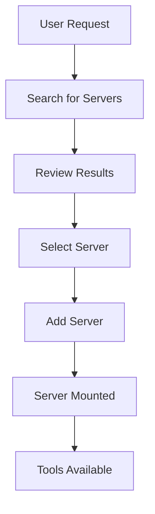
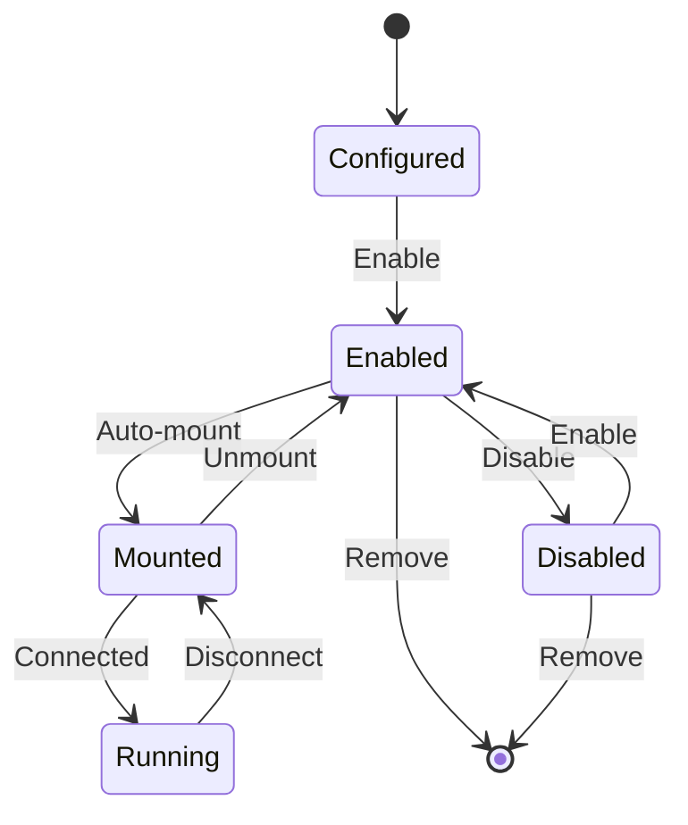
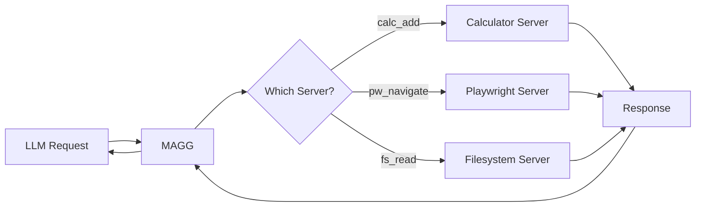

# MAGG Documentation

## Table of Contents

1. [Overview](#overview)
2. [Getting Started](#getting-started)
3. [Usage Flows](#usage-flows)
4. [Tools Reference](#tools-reference)
5. [Resources Reference](#resources-reference)
6. [Prompts Reference](#prompts-reference)
7. [Example Sessions](#example-sessions)
8. [Advanced Configuration](#advanced-configuration)

## Overview

MAGG (MCP Aggregator) is a meta-MCP server that acts as a central hub for managing multiple MCP servers. It enables LLMs to dynamically discover, add, configure, and use tools from various MCP servers through a unified interface.

### Core Concepts

- **Server**: An MCP server configuration that provides tools
- **Prefix**: A namespace prefix for tools from a specific server
- **Mounting**: The process of connecting to an MCP server and exposing its tools
- **Tool Delegation**: Proxying tool calls to the appropriate server

## Getting Started

### Quick Start with Claude Desktop

1. Add MAGG to your Claude Desktop configuration:
   ```json
   {
     "mcpServers": {
       "magg": {
         "command": "uvx",
         "args": ["--from", "git+https://github.com/sitbon/magg.git", "magg", "serve"]
       }
     }
   }
   ```

2. Restart Claude Desktop

3. Ask Claude to list available servers or search for tools

### Quick Start with Command Line

```bash
# Run MAGG server
uvx --from git+https://github.com/sitbon/magg.git magg

# Or for HTTP mode
uvx --from git+https://github.com/sitbon/magg.git magg serve --http
```

## Usage Flows

### 1. Discovering and Adding Servers

The typical flow for discovering and adding new MCP servers:



**Steps:**

1. **Search for servers** using `magg_search_servers`:
   - Searches multiple sources (glama.ai, GitHub, NPM)
   - Returns servers with descriptions and URLs

2. **Review search results**:
   - Each result includes name, description, URL, and install command
   - Results are ranked by relevance and source

3. **Add selected server** using `magg_add_server`:
   - Provide name, URL, and command
   - Optional: specify prefix, working directory, notes

4. **Server is automatically mounted**:
   - MAGG connects to the server
   - Tools are discovered and registered

5. **Tools become available** with configured prefix

### 2. Managing Servers

Server lifecycle management flow:



**Operations:**

- **List servers**: `magg_list_servers` shows all configured servers
- **Enable/Disable**: Control whether servers are available
- **Remove**: Completely remove server configuration
- **Check status**: See which servers are mounted and running

### 3. Using Tools from Multiple Servers

Tool aggregation and delegation flow:



## Tools Reference

### Server Management Tools

#### `magg_add_server`
Add a new MCP server to the configuration.

**Parameters:**
- `name` (str, required): Unique server name
- `source` (str, required): URL or URI of the server package/repository (can be a local path as well)
- `command` (str, optional): Full command to run (e.g., "npx @playwright/mcp@latest")
- `prefix` (str, optional): Tool prefix (defaults to server name)
- `uri` (str, optional): URI for HTTP servers
- `env_vars` (dict, optional): Environment variables
- `working_dir` (str, optional): Working directory
- `notes` (str, optional): Setup notes
- `enable` (bool, optional): Whether to enable immediately (default: true)
- `transport` (dict, optional): Transport-specific configuration

**Example:**
```json
{
    "name": "playwright",
    "url": "https://github.com/microsoft/playwright-mcp",
    "command": "npx @playwright/mcp@latest",
    "prefix": "pw",
    "notes": "Browser automation tools"
}
```

#### `magg_remove_server`
Remove a server from the configuration.

**Parameters:**
- `name` (str, required): Name of server to remove

#### `magg_list_servers`
List all configured servers with their status.

**Returns:**
```json
{
    "servers": [{
        "name": "calculator",
        "url": "...",
        "prefix": "calc",
        "enabled": true,
        "mounted": true
    }]
}
```

#### `magg_enable_server` / `magg_disable_server`
Enable or disable a server without removing it.

**Parameters:**
- `name` (str, required): Server name to enable/disable

### Discovery Tools

#### `magg_search_servers`
Search for MCP servers across multiple sources.

**Parameters:**
- `query` (str, required): Search query
- `limit` (int, optional): Maximum results (default: 5)

**Returns:**
```json
{
    "results": [{
        "name": "Playwright MCP",
        "description": "Browser automation...",
        "url": "https://github.com/microsoft/playwright-mcp",
        "source": "github",
        "install_command": "npm install @playwright/mcp"
    }]
}
```

#### `magg_list_tools`
List all available tools from all mounted servers.

**Returns:**
```json
{
    "tool_groups": [{
        "prefix": "calc",
        "tools": ["calc_add", "calc_subtract", ...],
        "count": 6
    }],
    "total_tools": 15
}
```

### Configuration Tools

#### `magg_smart_configure`
Intelligently configure a server from just a URL using MCP sampling.

**Parameters:**
- `url` (str, required): URL of the server
- `server_name` (str, optional): Preferred server name

**Note:** Requires MCP client support for sampling.

#### `magg_analyze_servers`
Analyze configured servers and provide insights/recommendations.

**Note:** Requires MCP client support for sampling.

## Resources Reference

MAGG exposes MCP resources for introspection:

### `magg://server/{name}`
Get metadata for a specific server.

**Example URI:** `magg://server/calc`

**Returns:** JSON with server configuration and status.

### `magg://servers/all`
Get metadata for all configured servers.

**Returns:** JSON with all server configurations.

## Prompts Reference

### `configure_server`
Interactive prompt for configuring a server with LLM assistance.

**Usage:** The LLM can use this prompt to help determine optimal configuration for a server based on its URL.

## Example Sessions

See [examples.md](examples.md) for detailed example sessions demonstrating MAGG's capabilities.

## Advanced Configuration

### Server Configuration File

Servers are stored in the current directory under `.magg/servers.json`:

```json
{
  "servers": {
    "calc": {
      "name": "calc",
      "source": "https://github.com/wrtnlabs/calculator-mcp",
      "prefix": "calc",
      "notes": null,
      "command": "npx",
      "args": [
        "-y",
        "@wrtnlabs/calculator-mcp@latest"
      ],
      "uri": null,
      "env": null,
      "working_dir": null,
      "transport": null,
      "enabled": true
    }
  }
}
```

### Custom Server Setup

For servers requiring special setup:

**With virtual environment:**
   ```json
   {
     "name": "custom-server",
     "source": "file:///path/to/server", 
     "prefix": "custom",
     "command": "uv run python server.py",
     "working_dir": "/path/to/server"
   }
   ```

**With Docker:**
   ```json
   {
     "name": "docker-server",
     "source": "docker://myimage:tag", 
     "prefix": "myimage",
     "command": "docker run -i myimage:tag",
     "env_vars": {
       "DOCKER_HOST": "unix:///var/run/docker.sock"
     }
   }
   ```

### Debugging

Enable debug logging to troubleshoot issues:

```bash
MAGG_LOG_LEVEL=DEBUG magg serve --http
```

Check logs for:
- Server mounting failures
- Tool delegation errors
- Configuration problems

### Performance Optimization

1. **Disable unused servers** to reduce memory usage
2. **Use specific prefixes** to avoid tool name conflicts
3. **Monitor server processes** for resource usage

### Security Considerations

1. **API Keys**: Store in environment variables, never in configuration
2. **File Access**: Be cautious with filesystem servers
3. **Network Access**: Review server permissions for network operations
4. **Process Isolation**: Consider running servers in containers for isolation
